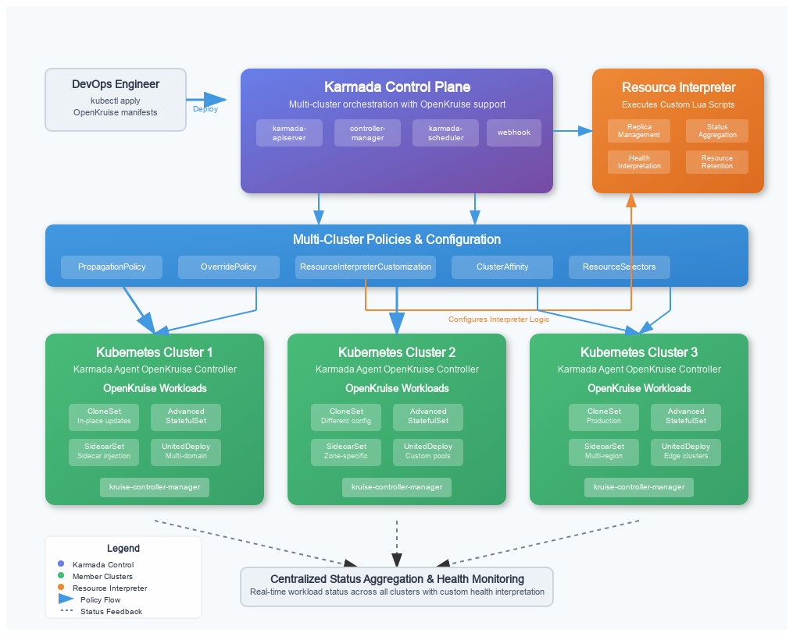

# Best Practices for OpenKruise Multi-Cluster Orchestration (Karmada/OCM)

**Last Updated:** July 28, 2025

---

## Table of Contents
- [Introduction](#introduction)
- [Architecture Overview](#architecture-overview)
- [Project Scope](#project-scope)
- [OpenKruise Workloads Overview](#openkruise-workloads-overview)
- [Karmada Integration](#karmada-integration)
  - [Karmada Installation and Setup](#karmada-installation-and-setup)
    - [Prerequisites](#prerequisites)
    - [Installing Karmada](#installing-karmada)
    - [Installing OpenKruise](#installing-openkruise)
    - [Correctness Check: Karmada Control Plane](#correctness-check-karmada-control-plane)
    - [Registering Clusters](#registering-clusters)
  - [Resource Interpreter Framework](#resource-interpreter-framework)
  - [CloneSet Integration with Karmada](#cloneset-integration-with-karmada)
  - [Advanced StatefulSet Integration with Karmada](#advanced-statefulset-integration-with-karmada)
  - [SidecarSet Integration with Karmada](#sidecarset-integration-with-karmada)
  - [UnitedDeployment Integration with Karmada](#uniteddeployment-integration-with-karmada)
- [Deployment](#deployment)
  - [Deploying CloneSet](#deploying-cloneset)
  - [Deploying Advanced StatefulSet](#deploying-advanced-statefulset)
  - [Deploying SidecarSet](#deploying-sidecarset)
  - [Deploying UnitedDeployment](#deploying-uniteddeployment)
  - [Apply the Resources](#apply-the-resources)
  - [Verify the Status](#verify-the-status)
  - [Testing & Verification](#testing--verification)
- [Best Practices for Karmada Integration](#best-practices-for-karmada-integration)
  - [Supported Workloads Status](#supported-workloads-status)
  - [General Best Practices](#general-best-practices)
    - [CRD Synchronization](#crd-synchronization)
    - [Interpreter Script Management](#interpreter-script-management)
    - [Use Policies for Granularity](#use-policies-for-granularity)
    - [Status and Health Checks](#status-and-health-checks)
    - [Version Alignment](#version-alignment)
    - [Security Best Practices](#security-best-practices)
    - [Monitoring and Observability](#monitoring-and-observability)
    - [Automation and GitOps](#automation-and-gitops)
  - [Workload-Specific Best Practices](#workload-specific-best-practices)
    - [CloneSet](#cloneset-1)
    - [Advanced StatefulSet](#advanced-statefulset-1)
    - [SidecarSet](#sidecarset-1)
    - [UnitedDeployment](#uniteddeployment-1)
- [Troubleshooting and Limitations](#troubleshooting-and-limitations)
- [Open Cluster Management (OCM) Integration](#open-cluster-management-ocm-integration)
  - [Architecture Overview for OCM](#architecture-overview-for-ocm)
  - [Installing and Configuring OCM](#installing-and-configuring-ocm)
  - [ManifestWork for OpenKruise Workloads](#manifestwork-for-openkruise-workloads)
  - [Best Practices for OCM Integration](#best-practices-for-ocm-integration)
- [Troubleshooting Guide](#troubleshooting-guide)
- [Common Challenges and Solutions](#common-challenges-and-solutions)
- [FAQ](#faq)
- [References](#references)

---

## Introduction

This guide provides practical best practices for deploying and managing OpenKruise workloads across multiple Kubernetes clusters using Karmada or Open Cluster Management (OCM). It is intended for platform engineers, SREs, and DevOps teams who want to achieve reliable, scalable, and maintainable multi-cluster application delivery.

Multi-cluster orchestration is crucial for achieving high availability, robust disaster recovery, geographic proximity for lower latency, and optimizing costs through efficient resource utilization. This document details how OpenKruise, an advanced workload management suite, integrates seamlessly with multi-cluster control planes to deliver these benefits.

**What you'll learn:**
- How to set up and integrate OpenKruise with Karmada/OCM
- How to deploy and manage advanced workloads (CloneSet, Advanced StatefulSet, SidecarSet, UnitedDeployment)
- How to validate, monitor, and troubleshoot your multi-cluster deployments
- Key best practices for production environments

---

## Architecture Overview



*Figure: High-level architecture of multi-cluster orchestration with Karmada and OpenKruise.*

**System Components:**
- **Karmada Control Plane:** Manages multi-cluster orchestration and policy propagation.
- **Member Clusters:** Kubernetes clusters registered with Karmada, each running OpenKruise.
- **OpenKruise:** Installed in each member cluster to provide advanced workload management.
- **Workloads:** CloneSet, Advanced StatefulSet, SidecarSet, and UnitedDeployment resources managed across clusters.
- **Policies & Interpreters:** Control workload placement, overrides, and status aggregation.

**Interaction Flow:**
1. The Karmada control plane manages and propagates workload manifests and policies to member clusters.
2. OpenKruise in each member cluster manages the lifecycle of advanced workloads.
3. Policies and interpreters ensure correct placement, customization, and status reporting for each workload.

---

## Project Scope

- **Objective:** Provide official, actionable guidelines for multi-cluster OpenKruise workload management.
- **Audience:** Engineers and operators working with Karmada, OCM, and OpenKruise.
- **Coverage:** Installation, integration, workload deployment, validation, troubleshooting, and best practices.

### Goals
- Successfully deploy and manage OpenKruise workloads with Karmada/OCM
- Understand how to write and use custom interpreters
- Implement robust multi-cluster scaling and management strategies
- Validate, monitor, and troubleshoot multi-cluster deployments

---

## OpenKruise Workloads Overview

- **CloneSet:** Advanced deployment with in-place updates and rolling strategies.
- **Advanced StatefulSet:** Stateful workloads with enhanced features.
- **SidecarSet:** Dynamic sidecar injection and management.
- **UnitedDeployment:** Multi-domain workload management for fine-grained control.

---

## Karmada Integration

It's a common and recommended practice to propagate the OpenKruise Custom Resource Definitions (CRDs) and its controller (manager) to member clusters using Karmada's `ClusterPropagationPolicy`. This automates the setup of OpenKruise across your fleet, ensuring consistency and simplified management, rather than manually installing it on each member cluster.

### Karmada Installation and Setup

#### Prerequisites

* At least one Karmada control plane cluster
* Two or more Kubernetes clusters as Karmada members
* OpenKruise installed on each member cluster
* `kubectl` access to all clusters
* Familiarity with YAML and basic Lua scripting

#### Installing Karmada

```bash
# Clone and install Karmada
git clone https://github.com/karmada-io/karmada
cd karmada
hack/local-up-karmada.sh
export KUBECONFIG="$HOME/.kube/karmada.config"
```

#### Correctness Check: Karmada Control Plane

After installation, verify that the Karmada control plane is running:

```bash
kubectl get pods -n karmada-system
```

> **Expected Output:** All pods should be in the `Running` state. If not, check logs with:
>
> ```bash
> kubectl logs -n karmada-system <pod-name>
> ```

#### Registering Clusters

```bash
# Register member clusters
kubectl karmada join <CLUSTER_NAME> --cluster-kubeconfig=<MEMBER_CLUSTER_KUBECONFIG>

# Verify registration
kubectl get clusters --kubeconfig=$HOME/.kube/karmada.config
```

### Resource Interpreter Framework

The `ResourceInterpreterCustomization` CRD allows you to define how Karmada understands and interacts with custom resources like those provided by OpenKruise. These interpreter definitions are themselves declarative Kubernetes objects, meaning they can be version-controlled and applied using GitOps principles, ensuring consistent behavior across your entire multi-cluster environment.

- **Built-in Interpreter**: Handles standard Kubernetes resources.
- **Customized Interpreter**: For CRDs (like OpenKruise), users can define custom logic using Lua scripts via the `ResourceInterpreterCustomization` CRD.
- **Modes**:
  - **Declarative**: Use JSONPath for simple field mapping.
  - **Lua Script**: For advanced logic, write Lua scripts for operations like replica calculation, status aggregation, retention, and health checks.

**Reference:** [Karmada Resource Interpreter Guide](https://karmada.io/docs/userguide/globalview/customizing-resource-interpreter/)

### CloneSet Integration with Karmada

To enable Karmada to manage OpenKruise CloneSet resources, you must define a `ResourceInterpreterCustomization` for CloneSet. This can be done using Lua scripts for advanced behaviors.

#### Example: ResourceInterpreterCustomization for CloneSet

```yaml
apiVersion: config.karmada.io/v1alpha1
kind: ResourceInterpreterCustomization
metadata:
  name: openkruise-cloneset-interpreter
spec:
  target:
    apiVersion: apps.kruise.io/v1alpha1
    kind: CloneSet
  customizations:
    replicas:
      luaScript: |
        local kube = require("kube")
        function GetReplicas(obj)
          local replica = obj.spec.replicas
          local requirement = kube.accuratePodRequirements(obj.spec.template)
          return replica, requirement
        end
    reviseReplica:
      luaScript: |
        function ReviseReplica(obj, desiredReplica)
          obj.spec.replicas = desiredReplica
          return obj
        end
    statusAggregation:
      luaScript: |
        function AggregateStatus(desiredObj, statusItems)
          local replicas = 0
          local updatedReplicas = 0
          local readyReplicas = 0
          local availableReplicas = 0
          local updatedReadyReplicas = 0
          local expectedUpdatedReplicas = 0
          for i = 1, #statusItems do
            local status = statusItems[i].status or {}
            replicas = replicas + (status.replicas or 0)
            updatedReplicas = updatedReplicas + (status.updatedReplicas or 0)
            readyReplicas = readyReplicas + (status.readyReplicas or 0)
            availableReplicas = availableReplicas + (status.availableReplicas or 0)
            updatedReadyReplicas = updatedReadyReplicas + (status.updatedReadyReplicas or 0)
            expectedUpdatedReplicas = expectedUpdatedReplicas + (status.expectedUpdatedReplicas or 0)
          end
          return {
            replicas = replicas,
            updatedReplicas = updatedReplicas,
            readyReplicas = readyReplicas,
            availableReplicas = availableReplicas,
            updatedReadyReplicas = updatedReadyReplicas,
            expectedUpdatedReplicas = expectedUpdatedReplicas
          }
        end
    retention:
      luaScript: |
        function Retain(desiredObj, observedObj)
          if observedObj.spec.suspend ~= nil then
            desiredObj.spec.suspend = observedObj.spec.suspend
          end
          if observedObj.status ~= nil then
            desiredObj.status = observedObj.status
          end
          return desiredObj
        end
    healthInterpretation:
      luaScript: |
        function InterpretHealth(observedObj)
          if observedObj.status == nil then
            return false
          end
          -- Check if we have the expected number of ready replicas
          local specReplicas = (observedObj.spec and observedObj.spec.replicas) or 0
          local readyReplicas = observedObj.status.readyReplicas or 0
          local availableReplicas = observedObj.status.availableReplicas or 0
          
          -- Healthy if all replicas are ready and available
          return readyReplicas == specReplicas and availableReplicas == specReplicas and specReplicas > 0
        end
```

**Key Points:**
- Use Lua scripts for advanced field handling and status aggregation.
- Adjust field names as needed for other OpenKruise workloads.
- Test interpreter scripts in a staging environment before production.

### Advanced StatefulSet Integration with Karmada

Advanced StatefulSet provides more features than the native StatefulSet. You should create a similar `ResourceInterpreterCustomization` for Advanced StatefulSet, adjusting field names as needed.

> **Note on Naming:** OpenKruise's Advanced StatefulSet is identified by `apiVersion: apps.kruise.io/v1beta1` and `kind: StatefulSet`. This distinguishes it from the native Kubernetes StatefulSet (`apiVersion: apps/v1`, `kind: StatefulSet`) and is important to specify correctly in policies and interpreters.

#### Example: ResourceInterpreterCustomization for Advanced StatefulSet

```yaml
apiVersion: config.karmada.io/v1alpha1
kind: ResourceInterpreterCustomization
metadata:
  name: openkruise-advancedstatefulset-interpreter
spec:
  target:
    apiVersion: apps.kruise.io/v1beta1
    kind: StatefulSet
  customizations:
    replicas:
      luaScript: |
        function GetReplicas(obj)
          return obj.spec.replicas
        end
    reviseReplica:
      luaScript: |
        function ReviseReplica(obj, desiredReplica)
          obj.spec.replicas = desiredReplica
          return obj
        end
    statusAggregation:
      luaScript: |
        function AggregateStatus(desiredObj, statusItems)
          local replicas = 0
          local readyReplicas = 0
          local currentReplicas = 0
          local updatedReplicas = 0
          for i = 1, #statusItems do
            local status = statusItems[i].status or {}
            replicas = replicas + (status.replicas or 0)
            readyReplicas = readyReplicas + (status.readyReplicas or 0)
            currentReplicas = currentReplicas + (status.currentReplicas or 0)
            updatedReplicas = updatedReplicas + (status.updatedReplicas or 0)
          end
          return {
            replicas = replicas,
            readyReplicas = readyReplicas,
            currentReplicas = currentReplicas,
            updatedReplicas = updatedReplicas
          }
        end
    # The retention of podManagementPolicy is not required if you use OrderedReady as recommended in best practices.
    # retention:
    #   luaScript: |
    #     function Retain(desiredObj, observedObj)
    #       if observedObj.spec.podManagementPolicy ~= nil then
    #         desiredObj.spec.podManagementPolicy = observedObj.spec.podManagementPolicy
    #       end
    #       return desiredObj
    #     end
    healthInterpretation:
      luaScript: |
        function InterpretHealth(observedObj)
          if observedObj.status == nil or observedObj.status.readyReplicas == nil or observedObj.status.replicas == nil then
            return false
          end
          return observedObj.status.readyReplicas == observedObj.status.replicas
        end
```

### SidecarSet Integration with Karmada

SidecarSet is used to manage sidecar containers across pods. You can define a custom interpreter for SidecarSet as follows:

#### Example: ResourceInterpreterCustomization for SidecarSet

```yaml
apiVersion: config.karmada.io/v1alpha1
kind: ResourceInterpreterCustomization
metadata:
  name: openkruise-sidecarset-interpreter
spec:
  target:
    apiVersion: apps.kruise.io/v1alpha1
    kind: SidecarSet
  customizations:
    statusReflection:
      luaScript: |
        function ReflectStatus(observedObj)
          if observedObj.status == nil then
            return {}
          end
          return {
            matchedPods = observedObj.status.matchedPods or 0,
            updatedPods = observedObj.status.updatedPods or 0,
            readyPods = observedObj.status.readyPods or 0
          }
        end
    replicaResource:
      luaScript: |
        function GetReplicas(obj)
          -- SidecarSet doesn't manage replicas directly, return 0
          return 0
        end
    statusAggregation:
      luaScript: |
        function AggregateStatus(desiredObj, statusItems)
          local matchedPods = 0
          local updatedPods = 0
          local readyPods = 0
          for i = 1, #statusItems do
            local status = statusItems[i].status or {}
            matchedPods = matchedPods + (status.matchedPods or 0)
            updatedPods = updatedPods + (status.updatedPods or 0)
            readyPods = readyPods + (status.readyPods or 0)
          end
          return {
            apiVersion = "apps.kruise.io/v1alpha1",
            kind = "SidecarSet",
            metadata = desiredObj.metadata,
            status = {
              matchedPods = matchedPods,
              updatedPods = updatedPods,
              readyPods = readyPods
            }
          }
        end
    retention:
      luaScript: |
        function Retain(desiredObj, observedObj)
          -- No specific retention logic needed as Karmada handles status preservation
          return desiredObj
        end
    healthInterpretation:
      luaScript: |
        function InterpretHealth(observedObj)
          if observedObj.status == nil then
            return false
          end
          local matchedPods = observedObj.status.matchedPods or 0
          local updatedPods = observedObj.status.updatedPods or 0
          -- If no pods are matched, consider it healthy (nothing to update)
          if matchedPods == 0 then
            return true
          end
          -- A SidecarSet is healthy if all matched pods have been updated
          return updatedPods == matchedPods
        end
    dependencyInterpretation:
      luaScript: |
        -- Karmada does not manage dependencies for SidecarSet by default.
        function GetDependencies(desiredObj)
          local dependencies = {}
          if not desiredObj.spec then
            return dependencies
          end
          -- Helper function to add a dependency
          local function addDependency(kind, name, namespace)
            table.insert(dependencies, {
              apiVersion = "v1",
              kind = kind,
              name = name,
              namespace = namespace or (desiredObj.metadata and desiredObj.metadata.namespace)
            })
          end
```

### UnitedDeployment Integration with Karmada

UnitedDeployment manages multiple workloads across different domains (e.g., zones, clusters). Its interpreter should aggregate status and handle domain-specific logic.

> **Strategy Note:** `UnitedDeployment` provides its own native topology management for distributing workloads across different pools (e.g., zones or clusters). This is useful for managing domain-specific configurations from a single resource. Alternatively, you can use a simpler workload (like a `CloneSet`) and rely on Karmada's `PropagationPolicy` and `OverridePolicy` for multi-cluster distribution.
> 
> - **Use `UnitedDeployment` when:** You need fine-grained control over workload subsets within a single manifest, such as different resource requests or image versions per zone.
> - **Use Karmada policies when:** You prefer to manage distribution and configuration overrides at the orchestration layer, keeping the base workload manifest simpler.

#### Example: ResourceInterpreterCustomization for UnitedDeployment

```yaml
apiVersion: config.karmada.io/v1alpha1
kind: ResourceInterpreterCustomization
metadata:
  name: openkruise-uniteddeployment-interpreter
spec:
  target:
    apiVersion: apps.kruise.io/v1alpha1
    kind: UnitedDeployment
  customizations:
    statusAggregation:
      luaScript: |
        function AggregateStatus(desiredObj, statusItems)
          local replicas = 0
          local readyReplicas = 0
          for i = 1, #statusItems do
            local status = statusItems[i].status or {}
            replicas = replicas + (status.replicas or 0)
            readyReplicas = readyReplicas + (status.readyReplicas or 0)
          end
          return {
            replicas = replicas,
            readyReplicas = readyReplicas
          }
        end
    healthInterpretation:
      luaScript: |
        function InterpretHealth(observedObj)
          if observedObj.status == nil or observedObj.spec == nil or observedObj.spec.replicas == nil or observedObj.status.readyReplicas == nil then
            return false
          end
          -- A UnitedDeployment is healthy if all its replicas are ready.
          return observedObj.spec.replicas == observedObj.status.readyReplicas
        end
```

# Deployment

Sample workload manifests for all major OpenKruise workload types (CloneSet, Advanced StatefulSet, SidecarSet, UnitedDeployment) are provided below for your reference. You only need to create and apply the manifests for the workloads you actually want to deploy.

## Deploying CloneSet

#### Sample CloneSet YAML

```yaml
apiVersion: apps.kruise.io/v1alpha1
kind: CloneSet
metadata:
  name: sample-cloneset
  namespace: default
spec:
  replicas: 2
  selector:
    matchLabels:
      app: sample
  template:
    metadata:
      labels:
        app: sample
    spec:
      containers:
        - name: nginx
          image: nginx:1.21
```

#### Sample PropagationPolicy YAML for CloneSet

```yaml
apiVersion: policy.karmada.io/v1alpha1
kind: PropagationPolicy
metadata:
  name: sample-cloneset-propagation
  namespace: default
spec:
  resourceSelectors:
    - apiVersion: apps.kruise.io/v1alpha1
      kind: CloneSet
      name: sample-cloneset
  placement:
    clusterAffinity:
      clusterNames:
        - member1
        - member2
```

## Deploying Advanced StatefulSet

#### Sample Advanced StatefulSet YAML

This example demonstrates a minimal Advanced StatefulSet manifest using OpenKruise:

```yaml
apiVersion: apps.kruise.io/v1beta1
kind: StatefulSet
metadata:
  name: sample-advancedstatefulset
  namespace: default
spec:
  serviceName: sample-service
  replicas: 2
  selector:
    matchLabels:
      app: sample-advancedstatefulset
  template:
    metadata:
      labels:
        app: sample-advancedstatefulset
    spec:
      containers:
        - name: nginx
          image: nginx:1.21
  volumeClaimTemplates:
    - metadata:
        name: data
      spec:
        accessModes: ["ReadWriteOnce"]
        resources:
          requests:
            storage: 1Gi
```

#### Sample PropagationPolicy YAML for Advanced StatefulSet

```yaml
apiVersion: policy.karmada.io/v1alpha1
kind: PropagationPolicy
metadata:
  name: advancedstatefulset-propagation
  namespace: default
spec:
  resourceSelectors:
    - apiVersion: apps.kruise.io/v1beta1
      kind: StatefulSet
      name: sample-advancedstatefulset
  placement:
    clusterAffinity:
      clusterNames:
        - member1
        - member2
```

## Deploying SidecarSet

#### Sample SidecarSet YAML

This example demonstrates a minimal SidecarSet manifest using OpenKruise:

> **Note:** The selector in SidecarSet must match the labels of the pods you want to inject the sidecar into.

```yaml
apiVersion: apps.kruise.io/v1alpha1
kind: SidecarSet
metadata:
  name: sample-sidecarset
  namespace: default
spec:
  selector:
    matchLabels:
      app: sample
  containers:
    - name: sidecar
      image: busybox:1.28
      command: ["sleep", "3600"]
```

#### Sample PropagationPolicy YAML for SidecarSet

```yaml
apiVersion: policy.karmada.io/v1alpha1
kind: PropagationPolicy
metadata:
  name: sidecarset-propagation
  namespace: default
spec:
  resourceSelectors:
    - apiVersion: apps.kruise.io/v1alpha1
      kind: SidecarSet
      name: sample-sidecarset
  placement:
    clusterAffinity:
      clusterNames:
        - member1
        - member2
```

## Deploying UnitedDeployment

#### Sample UnitedDeployment YAML

This example demonstrates a minimal UnitedDeployment manifest using OpenKruise:

```yaml
apiVersion: apps.kruise.io/v1alpha1
kind: UnitedDeployment
metadata:
  name: sample-uniteddeployment
  namespace: default
spec:
  replicas: 4
  selector:
    matchLabels:
      app: sample-uniteddeployment
  template:
    metadata:
      labels:
        app: sample-uniteddeployment
    spec:
      containers:
        - name: nginx
          image: nginx:1.21
  topology:
    pools:
      - name: pool-a
        nodeSelectorTerm:
          matchExpressions:
            - key: topology.kubernetes.io/zone
              operator: In
              values: ["zone-a"]
        replicas: 2
      - name: pool-b
        nodeSelectorTerm:
          matchExpressions:
            - key: topology.kubernetes.io/zone
              operator: In
              values: ["zone-b"]
        replicas: 2
```

#### Sample PropagationPolicy YAML for UnitedDeployment

```yaml
apiVersion: policy.karmada.io/v1alpha1
kind: PropagationPolicy
metadata:
  name: uniteddeployment-propagation
  namespace: default
spec:
  resourceSelectors:
    - apiVersion: apps.kruise.io/v1alpha1
      kind: UnitedDeployment
      name: sample-uniteddeployment
  placement:
    clusterAffinity:
      clusterNames:
        - member1
        - member2
```

### Apply the Resources

```bash
# Apply the CloneSet
kubectl apply -f sample-cloneset.yaml

# Apply the Advanced StatefulSet
kubectl apply -f sample-advancedstatefulset.yaml

# Apply the SidecarSet
kubectl apply -f sample-sidecarset.yaml

# Apply the UnitedDeployment
kubectl apply -f sample-uniteddeployment.yaml

# Apply the PropagationPolicies
kubectl apply -f sample-propagationpolicy-cloneset.yaml
kubectl apply -f sample-propagationpolicy-advancedstatefulset.yaml
kubectl apply -f sample-propagationpolicy-sidecarset.yaml
kubectl apply -f sample-propagationpolicy-uniteddeployment.yaml
```

### Verify the Status

1. **Check the clusters managed by Karmada:**
   ```bash
   karmadactl get clusters
   ```
2. **Check the CloneSet status across all clusters:**
   ```bash
   kubectl get cloneset -A
   ```
3. **Check the Advanced StatefulSet status across all clusters:**
   ```bash
   kubectl get statefulset -A
   ```
4. **Check the SidecarSet status across all clusters:**
   ```bash
   kubectl get sidecarset -A
   ```
5. **Check the UnitedDeployment status across all clusters:**
   ```bash
   kubectl get uniteddeployment -A
   ```
6. **Check the propagated resource in a specific member cluster:**
   ```bash
   kubectl --kubeconfig=<MEMBER_CLUSTER_KUBECONFIG> get all -n default
   ```

### Testing & Verification

To verify that your workload is distributed and running correctly across clusters:

1. **List all clusters managed by Karmada:**
   ```bash
   karmadactl get clusters
   ```
2. **Check workload status in the control plane:**
   ```bash
   kubectl get cloneset,statefulset,sidecarset,uniteddeployment -A
   ```
3. **Check workload status in each member cluster:**
   ```bash
   kubectl --kubeconfig=<MEMBER_CLUSTER_KUBECONFIG> get all -n default
   ```
4. **Check pod status in each member cluster:**
   ```bash
   kubectl --kubeconfig=<MEMBER_CLUSTER_KUBECONFIG> get pods -n default
   ```
5. **Check logs for a pod (optional):**
   ```bash
   kubectl --kubeconfig=<MEMBER_CLUSTER_KUBECONFIG> logs <POD_NAME> -n default
   ```
6. **Check PropagationPolicy status:**
   ```bash
   kubectl get propagationpolicy -n default
   kubectl describe propagationpolicy <policy-name> -n default
   ```

## Best Practices for Karmada Integration

### Supported Workloads Status

| Workload | Karmada Support | Status | Notes |
|----------|----------------|--------|-------|
| **CloneSet** | ✅ Full Support | Production Ready | Most mature integration |
| **Advanced StatefulSet** | ✅ Full Support | Production Ready | Enhanced StatefulSet features |
| **SidecarSet** | ⚠️ Limited Support | Experimental | Requires custom interpreter |
| **UnitedDeployment** | ⚠️ Limited Support | Experimental | Requires custom interpreter |

> **Tip:** Always check the [Karmada Supported Versions](https://karmada.io/docs/releases/#support-versions) and [OpenKruise Releases](https://github.com/openkruise/kruise/releases) for the latest compatibility and supported features.

## General Best Practices

#### CRD Synchronization
- Ensure OpenKruise CRDs are installed on all member clusters *before* propagating workloads. Use Karmada's `ClusterPropagationPolicy` to distribute the CRD definitions themselves.
- Keep CRD versions consistent across the fleet to avoid compatibility issues.

#### Interpreter Script Management
- Store your `ResourceInterpreterCustomization` scripts in version control (e.g., Git).
- **Test scripts thoroughly in a staging environment before applying them to the Karmada control plane. A faulty script can impact workload orchestration.**
- **Cross-check all status fields referenced in your Lua scripts with the latest OpenKruise CRD specifications to ensure completeness and accuracy.**
- > **Warning:** Always add nil checks and error handling in Lua scripts to prevent runtime errors.

#### Use Policies for Granularity
- Use `PropagationPolicy` to control which clusters receive a workload.
- Use `OverridePolicy` to apply cluster-specific modifications, such as different resource limits, image tags, or replica counts.
> **Tip:** `OverridePolicy` is optional if you want the same configuration in all clusters, but is highly recommended for real-world multi-cluster management where per-cluster customization is needed.

#### Status and Health Checks
- Write robust `statusAggregation` scripts to get a meaningful overview of your multi-cluster workload.
- Define precise `healthInterpretation` logic. A workload isn't healthy just because it exists; it's healthy when it's ready and available.
- **Add robust nil-checking and error handling in all Lua scripts to prevent runtime errors.**

#### Version Alignment
- **Ensure that OpenKruise, Karmada, and Kubernetes versions are compatible and up-to-date. Always refer to the [Karmada Supported Versions](https://karmada.io/docs/releases/#support-versions) and [OpenKruise Releases](https://github.com/openkruise/kruise/releases) for compatibility information.**

#### Security Best Practices
- Use RBAC and least-privilege permissions for Karmada and OpenKruise controllers. Grant only the minimum necessary permissions. For Karmada, this typically means `get`, `list`, `watch`, `create`, `update`, `patch`, `delete` on the resources it manages (e.g., `PropagationPolicy`, `OverridePolicy`, `ResourceBinding`, and the specific workloads it federates). For OpenKruise, ensure its controller has permissions over its CRDs and the native Kubernetes resources it manages (Pods, StatefulSets, Deployments, etc.).
- Regularly review and audit access controls for all service accounts and users interacting with the Karmada control plane and member clusters.
- Grant `cluster-admin` privileges only when absolutely unavoidable, preferring namespaced or specific resource permissions.
> **Warning:** Overly broad permissions can lead to significant security vulnerabilities in your multi-cluster environment.

#### Monitoring and Observability
- Integrate with monitoring tools such as Prometheus and Grafana to track workload health, resource usage, and interpreter script status.
- Monitor the status of Karmada's `ResourceBinding` and `PropagationPolicy` objects to ensure successful distribution. Key metrics and events from the Karmada controller-manager and OpenKruise controller pods are essential.
- Set up alerts for failed propagations, unhealthy workloads (e.g., `readyReplicas` != `replicas`), or errors reported by interpreter scripts.
> **Tip:** Monitoring and alerting are essential for production-grade multi-cluster management. Pay close attention to logs from Karmada's `karmada-controller-manager` and `karmada-webhook` (for interpreter errors), as well as the OpenKruise manager in member clusters.

#### Automation and GitOps
- Use GitOps tools (e.g., Argo CD, Flux) to manage interpreter scripts, PropagationPolicies, and OverridePolicies declaratively.
- Store all configuration and policy YAMLs in version control for auditability and reproducibility.
- GitOps enables version control, auditability, and automated rollbacks for your multi-cluster policies.

## Workload-Specific Best Practices

### CloneSet

**What Works Well:**
- Basic replica management, image updates, scaling operations, and health checks are well supported.

**Limitations:**
- `partition` field is not supported for per-cluster partitioning.
- In-place update status fields may not aggregate correctly across clusters.

> **Workaround:** Use `OverridePolicy` for per-cluster partition control.

**Recommended Configuration:**
```yaml
apiVersion: apps.kruise.io/v1alpha1
kind: CloneSet
metadata:
  name: my-cloneset
spec:
  replicas: 3
  updateStrategy:
    type: RollingUpdate
    rollingUpdate:
      # Avoid using partition with Karmada
      # partition: 1
  template:
    metadata:
      labels:
        app: my-app
    spec:
      containers:
        - name: app
          image: my-app:v1.0.0
```

## Advanced StatefulSet

**What Works Well:**
- Replica management, volume management (with proper PVC propagation), ordered deployment.

**Limitations:**
- `partition` field is not natively supported for per-cluster partitioning by Karmada's propagation. This is because Karmada propagates the entire CloneSet manifest to a member cluster, and the local OpenKruise controller then applies the `partition` value within that single cluster's scope.
- In-place update status fields may not aggregate correctly across clusters without specific interpreter logic.

> **Workaround:** Use `OverridePolicy` for per-cluster partition control, allowing you to specify different partition values for the CloneSet in each target cluster.

> **Workaround:** Create a separate PropagationPolicy for PVCs if needed.

**Recommended Configuration:**
```yaml
apiVersion: apps.kruise.io/v1beta1
kind: StatefulSet
metadata:
  name: my-statefulset
spec:
  replicas: 3
  podManagementPolicy: OrderedReady
  serviceName: my-service
  template:
    metadata:
      labels:
        app: my-app
    spec:
      containers:
        - name: app
          image: my-app:v1.0.0
  volumeClaimTemplates:
    - metadata:
        name: data
      spec:
        accessModes: ["ReadWriteOnce"]
        resources:
          requests:
            storage: 1Gi
```

## SidecarSet

**What Works Well:**
- Sidecar injection, basic status reporting.

**Limitations:**
- Pod selector in `SidecarSet` may not match pods in all target clusters as expected if selectors are highly specific to a cluster's environment.
- Injection strategy (e.g., `Always`, `IfNotPresent`) may require careful consideration in multi-cluster scenarios to ensure sidecars are injected consistently and correctly across distributed pods.

> **Workaround:** Use `OverridePolicy` to adjust selectors per cluster, or ensure your pod labeling strategy is consistent across all clusters. Explicit injection strategies (`Always`, `IfNotPresent`) can help ensure predictable behavior.

**Recommended Configuration:**
```yaml
apiVersion: apps.kruise.io/v1alpha1
kind: SidecarSet
metadata:
  name: my-sidecarset
spec:
  selector:
    matchLabels:
      app: my-app
  containers:
    - name: sidecar
      image: sidecar:v1.0.0
      command: ["sleep", "3600"]
  injectionStrategy:
    revision: "v1"
    policy: "Always"
```

## UnitedDeployment

**What Works Well:**
- Basic replica distribution, simple topology management.

**Limitations:**
- Native topology management within `UnitedDeployment` (using `pools` with `nodeSelectorTerm` for cluster-level distribution) may conflict or overlap with Karmada's own advanced placement logic. Using both simultaneously for cluster selection can lead to unexpected behavior or redundant configuration.
- Status aggregation for `UnitedDeployment` can be complex due to its domain-specific nature.

> **Workaround:** For cluster distribution, it's generally recommended to rely primarily on Karmada's `PropagationPolicy` for cluster selection and replica distribution, using `UnitedDeployment`'s topology features for more granular control *within* a selected cluster (e.g., zone-based distribution via `nodeSelectorTerm`). Use simplified status aggregation scripts that focus on overall replica counts.

**Recommended Configuration:**
> **Note:** To avoid conflicts with Karmada's placement engine, use simple pools in UnitedDeployment. Cluster distribution should be handled by Karmada's PropagationPolicy, not UnitedDeployment's topology. If you need to use nodeSelectorTerm for grouping within a cluster, you can do so, but avoid using it for cross-cluster placement.

```yaml
apiVersion: apps.kruise.io/v1alpha1
kind: UnitedDeployment
metadata:
  name: my-uniteddeployment
spec:
  replicas: 4
  selector:
    matchLabels:
      app: my-app
  template:
    metadata:
      labels:
        app: my-app
    spec:
      containers:
        - name: app
          image: my-app:v1.0.0
  topology:
    pools:
      - name: default
        replicas: 2
        nodeSelectorTerm:
          matchExpressions:
            - key: topology.kubernetes.io/zone
              operator: In
              values: ["zone-a"]
      - name: another-pool
        replicas: 2
        nodeSelectorTerm:
          matchExpressions:
            - key: topology.kubernetes.io/zone
              operator: In
              values: ["zone-b"]
```

## Troubleshooting and Limitations

> **Tip:** See the Troubleshooting Guide section for common issues, debug commands, and workarounds for known limitations.

### Summary

- Follow these best practices to ensure robust, secure, and maintainable multi-cluster orchestration with Karmada and OpenKruise.
- Regularly review official documentation for updates and new features.
- Use monitoring, automation, and security best practices for production environments.

---

